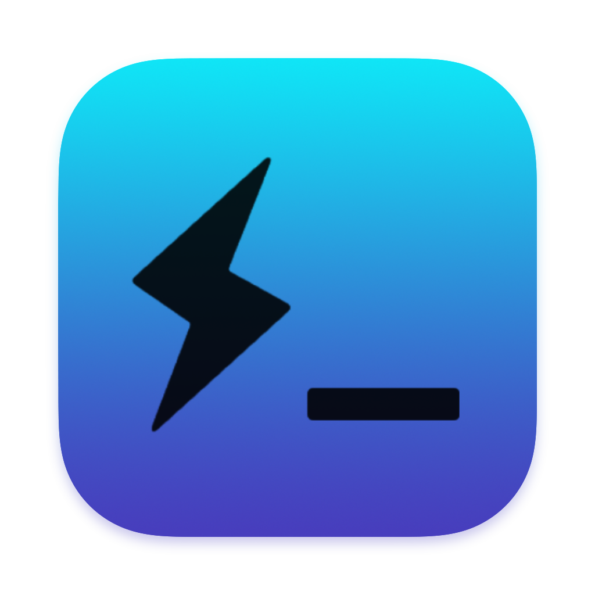

# FluPilot-CLI Desktop

A powerful terminal application built with Electron, node-pty, and xterm.js that provides Flutter development tools and UI exploration capabilities.

## Features

- 🖥️ **Cross-platform Terminal**: Modern terminal interface built with xterm.js
- 🎨 **Flutter UI Explorer**: Browse and explore Flutter UI templates
- 🔧 **Development Tools**: Integrated Flutter development utilities
- 🌈 **Multiple Themes**: Support for various color themes (Catppuccin, Dracula, Gruvbox, etc.)
- ⚡ **Fast Performance**: Built with Electron for native desktop experience
- 📱 **UI Templates**: Pre-built Flutter UI components and screens

## Screenshots



## Installation

### Prerequisites

- Node.js (v16 or higher)
- npm or yarn
- Flutter SDK (for Flutter-related features)

### From Source

```bash
# Clone the repository
git clone https://github.com/ahmedali109/FluPilot-CLI-Desktop.git
cd FluPilot-CLI-Desktop

# Install dependencies
npm install

# Run in development mode
npm run electron-dev
```

### Download Release

Download the latest release from the [Releases](https://github.com/ahmedali109/FluPilot-CLI-Desktop/releases) page.

## Usage

1. **Launch the application**

   ```bash
   npm run electron-dev
   ```

2. **Explore Flutter UI Templates**

   - Navigate through the UI explorer to find pre-built templates
   - Browse various categories of Flutter widgets and screens

3. **Terminal Features**
   - Use the integrated terminal for Flutter development
   - Access Flutter CLI commands directly

## Development

### Scripts

- `npm run electron-dev` - Run in development mode
- `npm run build` - Build the application
- `npm run build-mac` - Build for macOS
- `npm run build-win` - Build for Windows
- `npm run build-linux` - Build for Linux

### Project Structure

```text
├── main.js              # Main Electron process
├── renderer.js          # Renderer process
├── preload.js           # Preload script
├── assets/              # Application assets
├── scripts/             # Shell scripts and utilities
├── src/                 # Source code
├── styles/              # CSS styles
├── themes/              # Color themes
└── ui-projects-templates/ # Flutter UI templates
```

## Built With

- **[Electron](https://electronjs.org/)** - Desktop app framework
- **[xterm.js](https://xtermjs.org/)** - Terminal emulator
- **[node-pty](https://github.com/microsoft/node-pty)** - Pseudoterminal bindings
- **[Tailwind CSS](https://tailwindcss.com/)** - Utility-first CSS framework

## Contributing

1. Fork the repository
2. Create your feature branch (`git checkout -b feature/AmazingFeature`)
3. Commit your changes (`git commit -m 'Add some AmazingFeature'`)
4. Push to the branch (`git push origin feature/AmazingFeature`)
5. Open a Pull Request

## License

This project is licensed under the MIT License - see the [LICENSE](LICENSE) file for details.

## Author

**Ahmed Ali** - [@ahmedali109](https://github.com/ahmedali109)

## Acknowledgments

- Flutter team for the amazing framework
- Electron community for the desktop app platform
- xterm.js contributors for the terminal emulator
